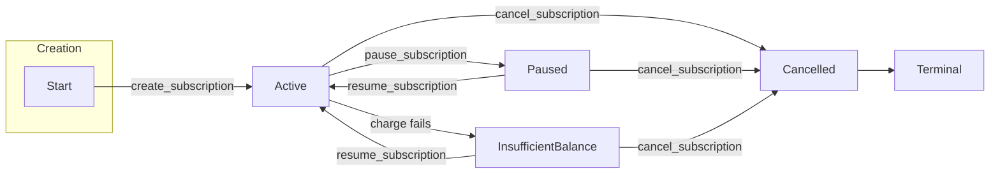

# Subscription Lifecycle and State Machine

This document describes the subscription lifecycle in the SubscriptionVault contract: how subscriptions are created, charged, paused, resumed, and cancelled; how status is represented on-chain; and the state machine that governs valid transitions. It aligns with the implementation in `contracts/subscription_vault/src/`.

For a compact state-machine-only view see [subscription_state_machine.md](subscription_state_machine.md).

---

## Overview

A subscription moves through a lifecycle from creation (always starting **Active**) through optional deposits, charges, and user-driven actions (pause, resume, cancel). The **status** field of each subscription is constrained by a state machine: only certain transitions are allowed (e.g. Active → Paused, InsufficientBalance → Active). Charging is performed when status is **Active** or **GracePeriod**; insufficient balance during a charge automatically moves the subscription into a recoverable non-active state (`GracePeriod` first when applicable, then `InsufficientBalance`). The **prepaid balance** is separate from status: deposits increase balance without changing status; the subscriber must explicitly **resume** after topping up to leave underfunded states.

---

## On-Chain Representation

### Subscription struct

Defined in `contracts/subscription_vault/src/types.rs`:

| Field | Type | Description |
|-------|------|-------------|
| `subscriber` | `Address` | Owner of the subscription; must auth create, deposit. |
| `merchant` | `Address` | Recipient of charges. |
| `amount` | `i128` | Charge amount per interval (in token base units). |
| `interval_seconds` | `u64` | Minimum time between charges. |
| `last_payment_timestamp` | `u64` | Ledger timestamp of last successful charge. |
| **`status`** | **`SubscriptionStatus`** | Lifecycle state; only changed via state machine transitions. |
| `prepaid_balance` | `i128` | Current balance; increased by deposit, decreased by successful charge. |
| `expiration` | `Option<u64>` | Optional ledger timestamp after which the subscription is expired. `None` means no expiry. Charging returns `Error::SubscriptionExpired` (4003) once `now >= expiration`. |
| `usage_enabled` | `bool` | Usage flag (reserved for future use). |

The **status** field is the only one modified by the state machine. Other fields change only through specific operations: `prepaid_balance` and `last_payment_timestamp` change on deposit and charge; the rest are set at creation (or not changed). The `expiration` field is checked on every charge attempt; it does not trigger an automatic status change but blocks charging via `Error::SubscriptionExpired`.

### Storage

Subscriptions are stored in contract instance storage, keyed by subscription id (`u32`). Each key maps to a `Subscription` value. The contract also stores `next_id` for allocating new ids, plus admin/config (token, admin, min_topup).

---

## SubscriptionStatus Variants

The enum is defined in `contracts/subscription_vault/src/types.rs`. Transition rules are implemented in `contracts/subscription_vault/src/state_machine.rs`.

### Active

- **Meaning:** Subscription is active and eligible for charging. Charges succeed when interval has elapsed and balance is sufficient.
- **How entered:** Created by `create_subscription` (initial status); or by `resume_subscription` from Paused or InsufficientBalance.
- **How exited:** `pause_subscription` → Paused; `cancel_subscription` → Cancelled; or a failed charge (insufficient balance) → InsufficientBalance (automatic inside `charge_one`).
- **Charges:** Allowed. `charge_subscription` and `batch_charge` call `charge_one`, which runs only when status is Active.

### Paused

- **Meaning:** Temporarily suspended; no charges are processed.
- **How entered:** `pause_subscription` from Active (authorizer: subscriber or merchant).
- **How exited:** `resume_subscription` → Active; `cancel_subscription` → Cancelled.
- **Charges:** Not allowed. Charge returns `Error::NotActive` (1002) without changing state.

### Cancelled

- **Meaning:** Permanently terminated. No further state changes or charges.
- **How entered:** `cancel_subscription` from Active, Paused, or InsufficientBalance.
- **How exited:** None. Terminal state; no transitions out (any attempt returns `Error::InvalidStatusTransition`).
- **Charges:** Not allowed. Charge returns `Error::NotActive` (1002).

### InsufficientBalance

- **Meaning:** A stored non-active state representing a subscription that requires topping up and explicit resume before future charges can proceed.
- **How entered:** Automatically when a charge attempt remains underfunded after grace eligibility has elapsed.
- **How exited:** `resume_subscription` → Active (only when `prepaid_balance >= amount`); `cancel_subscription` → Cancelled. The contract does **not** auto-transition to Active on deposit.
- **Charges:** Not allowed. Charge returns `Error::NotActive` (1002).

### GracePeriod

- **Meaning:** Recoverable underfunded state used before final insufficient-balance escalation.
- **How entered:** Failed charge while `now < last_payment_timestamp + interval_seconds + grace_period`.
- **How exited:** Successful charge or `resume_subscription` (with sufficient prepaid balance) → Active; later failed attempt after grace expiry → InsufficientBalance; `cancel_subscription` → Cancelled.
- **Charges:** Allowed to re-attempt charging while grace is active.

---

## State Machine and Transitions

### Allowed transitions

| From | To | Trigger |
|------|-----|--------|
| Active | Paused | `pause_subscription(subscription_id, authorizer)` |
| Active | Cancelled | `cancel_subscription(subscription_id, authorizer)` |
| Active | GracePeriod | Charge attempted, insufficient funds, and grace still active |
| Active | InsufficientBalance | Charge attempted, insufficient funds, and grace elapsed |
| GracePeriod | GracePeriod | Repeated failed charge while still in grace |
| GracePeriod | InsufficientBalance | Failed charge after grace expiry |
| GracePeriod | Active | Successful charge or `resume_subscription` with sufficient prepaid balance |
| GracePeriod | Cancelled | `cancel_subscription(subscription_id, authorizer)` |
| Paused | Active | `resume_subscription(subscription_id, authorizer)` |
| Paused | Cancelled | `cancel_subscription(subscription_id, authorizer)` |
| InsufficientBalance | Active | `resume_subscription(subscription_id, authorizer)` |
| InsufficientBalance | Cancelled | `cancel_subscription(subscription_id, authorizer)` |
| *any* | Same | Idempotent: transition to same status is always allowed (e.g. cancel when already Cancelled) |

Implementation: `validate_status_transition` in `contracts/subscription_vault/src/state_machine.rs` is used before every status update; `get_allowed_transitions(status)` returns the list of valid target statuses for a given state.

### Invalid transitions (blocked)

| From | To | Result |
|------|-----|--------|
| Cancelled | Active | `Error::InvalidStatusTransition` (400) — terminal state |
| Cancelled | Paused | `Error::InvalidStatusTransition` (400) |
| Cancelled | InsufficientBalance | `Error::InvalidStatusTransition` (400) |
| Paused | InsufficientBalance | Not reachable (charges not run when Paused) |
| InsufficientBalance | Paused | `Error::InvalidStatusTransition` (400) — must resume or cancel |

### State diagram

---

## Lifecycle Flows

### Creation

- **Entrypoint:** `create_subscription(env, subscriber, merchant, amount, interval_seconds, expiration: Option<u64>, usage_enabled)`  
  Auth: subscriber.  
  Implemented in `contracts/subscription_vault/src/subscription.rs`.
- **Validation:** Creation rejects `amount <= 0`, rejects intervals shorter than 60 seconds, and rejects blocklisted subscribers.
- **Effect:** A new subscription is stored with `status: Active`, `last_payment_timestamp: env.ledger().timestamp()`, `prepaid_balance: 0`. No charge runs at creation; the first charge requires a deposit and a later `charge_subscription` or `batch_charge` call.

### Deposit

- **Entrypoint:** `deposit_funds(env, subscription_id, subscriber, amount)`  
  Auth: subscriber.  
  Implemented in `subscription.rs`.
- **Effect:** Increases `prepaid_balance` by `amount`. Rejects deposits below the contract's `min_topup` threshold with `Error::BelowMinimumTopup` (5003). **Status is not changed.** If the new balance is sufficient, the contract emits a recovery-ready event to signal off-chain systems that resume can now succeed.

### Charging

- **Entrypoints:** `charge_subscription(env, subscription_id)` and `batch_charge(env, subscription_ids)`.  
  Auth: admin.  
  Both delegate to `charge_one` in `contracts/subscription_vault/src/charge_core.rs`.
- **Behavior:** Charges are attempted for **Active** and **GracePeriod** subscriptions. If `now < last_payment_timestamp + interval_seconds`, returns `Error::IntervalNotElapsed` (1001). On success, balance and `last_payment_timestamp` are updated and a charge statement is appended. On insufficient balance, no funds move and no statement is appended; instead status transitions to `GracePeriod` or `InsufficientBalance` and a charge-failed event is emitted.

### Pause / Resume / Cancel

- **Pause:** `pause_subscription(env, subscription_id, authorizer)` — validates transition to Paused, then sets `status = Paused`. Auth: subscriber or merchant. Implemented in `subscription.rs`.
- **Resume:** `resume_subscription(env, subscription_id, authorizer)` — validates transition to Active and enforces `prepaid_balance >= amount` when resuming from `GracePeriod` or `InsufficientBalance`. Auth: subscriber or merchant. Implemented in `subscription.rs`.
- **Cancel:** `cancel_subscription(env, subscription_id, authorizer)` — validates transition to Cancelled, then sets `status = Cancelled`. Auth: subscriber or merchant. Implemented in `subscription.rs`.

All three use `validate_status_transition` before updating status.

---

## Invariants and Edge Cases

1. **Only Active and GracePeriod subscriptions are charged.** Paused, Cancelled, and InsufficientBalance return `Error::NotActive` (1002) immediately.

2. **Failed interval charges persist only recoverable state transitions.** Financial accounting fields (`prepaid_balance`, `lifetime_charged`, merchant balances, statements) are unchanged on insufficient balance.

3. **Cancelled is terminal.** No transitions out of Cancelled; resume and all other status changes from Cancelled return `Error::InvalidStatusTransition` (400).

4. **Idempotent same-status.** Transitioning to the same status (e.g. calling cancel when already Cancelled) is allowed by `validate_status_transition`, so callers can safely retry.

5. **Resume behavior remains explicit and balance-gated.** Depositing does not change status. `resume_subscription` from `GracePeriod` or `InsufficientBalance` requires `prepaid_balance >= amount`.

6. **Interval check.** A charge is only attempted when `now >= last_payment_timestamp + interval_seconds`; otherwise `Error::IntervalNotElapsed` (1001) is returned.

7. **Batch charge.** `batch_charge` invokes `charge_one` per id and preserves the same ledger semantics as repeated single charges in input order. Successful items commit; failed items return their error code without extra side effects. Per-item errors are reported in `BatchChargeResult`; see `docs/batch_charge.md`.

---

## Error Codes (Lifecycle-Relevant)

From `contracts/subscription_vault/src/types.rs`. For the full canonical table with numeric codes and retry guidance, see [docs/errors.md](errors.md).

| Code | Variant | When |
|------|---------|------|
| 1001 | `Unauthorized` | Caller not authorized (e.g. not admin for charge, not subscriber/merchant for cancel/pause/resume). |
| 2001 | `NotFound` | Subscription id not found. |
| 4001 | `InvalidStatusTransition` | Invalid status transition (e.g. Cancelled → Active). |
| 4002 | `NotActive` | Charge attempted on non-Active/non-GracePeriod subscription. |
| 4003 | `SubscriptionExpired` | Charge attempted after the subscription's `expiration` timestamp. |
| 4004 | `IntervalNotElapsed` | Charge attempted before interval elapsed. |
| 5001 | `InsufficientBalance` | Charge failed due to insufficient prepaid balance. |
| 5003 | `BelowMinimumTopup` | Deposit is below the configured `min_topup` threshold. |

---

## Example Timelines

### Happy path

1. Subscriber: `create_subscription` → subscription stored, status **Active**, balance 0.
2. Subscriber: `deposit_funds` → balance increased, status remains Active.
3. Admin: `charge_subscription` (after interval elapsed) → balance decreased, `last_payment_timestamp` updated, status Active.
4. Repeat 2–3 as needed; eventually subscriber or merchant: `cancel_subscription` → status **Cancelled** (terminal).

### Insufficient balance then recover

1. Create → Active; deposit some funds.
2. Admin: `charge_subscription` (or `batch_charge`) with low balance → status moves to `GracePeriod` or `InsufficientBalance`, `charge_failed` event emitted, no statement appended.
3. Subscriber: `deposit_funds` → balance increased (and `recovery_ready` event emitted if now sufficient).
4. Subscriber or merchant: `resume_subscription` → Active once sufficient.
5. Admin: next charge with sufficient prepaid balance succeeds.

### Pause and resume

1. Subscription is Active. Subscriber or merchant: `pause_subscription` → **Paused**.
2. Later: same or other party: `resume_subscription` → **Active**. Alternatively: `cancel_subscription` from Paused → **Cancelled**.

---

## Golden Path Test Expectations

The end-to-end fixture coverage for maintainers lives in:

- `test_billing_lifecycle_golden_path_end_to_end`
- `test_billing_lifecycle_delayed_charge_and_min_topup_progression`

The native Soroban test harness assertions focus on balances, statuses, timestamps, withdrawals, and statement history. The vault event expectations below are documented for reviewer and indexer verification alongside those state assertions.

These tests use the shared fixture constants from `contracts/subscription_vault/src/test.rs`:

- `AMOUNT = 10_000_000` (10 USDC)
- `PREPAID = 50_000_000` (50 USDC)
- `INTERVAL = 30 days`
- `min_topup = 1_000_000` (1 USDC)

### Expected outputs: full golden path

1. After `create_subscription`: status is **Active**, `prepaid_balance = 0`, merchant balance is `0`, and the vault has emitted one `created` event.
2. After `deposit_funds(PREPAID)`: subscription balance is `50_000_000`, subscriber wallet is debited by the same amount, vault token balance becomes `50_000_000`, and one `deposited` event is visible from the vault contract.
3. After two successful interval charges: status remains **Active**, `prepaid_balance = 30_000_000`, `lifetime_charged = 20_000_000`, merchant balance becomes `20_000_000`, and the vault has emitted two `charged` events.
4. Statement reads must show two immutable rows with monotonic sequences `0` and `1`. Newest-first reads return sequence `1` first; cursor pagination returns `next_cursor = Some(0)` for the first page and `None` for the second.
5. After `withdraw_merchant_funds(20_000_000)`: merchant internal balance is `0`, merchant wallet receives `20_000_000`, vault token balance falls to `30_000_000`, and one `withdrawn` event is emitted by the vault.
6. After cancel plus subscriber refund: status is **Cancelled**, remaining prepaid balance is withdrawn back to the subscriber, and vault token balance returns to `0`.

### Expected outputs: delayed charge plus minimum top-up progression

1. Start with a `19_000_000` deposit. A delayed first charge at `T0 + 2 * INTERVAL + 77` still charges only one interval, leaving `prepaid_balance = 9_000_000`, `lifetime_charged = 10_000_000`, and merchant balance `10_000_000`.
2. A follow-up deposit of exactly `1_000_000` satisfies the configured minimum top-up and restores the prepaid balance to exactly one interval (`10_000_000`).
3. The next on-time charge reduces prepaid balance to `0`, raises merchant balance to `20_000_000`, and leaves two statement rows whose period boundaries reflect the actual delayed charge timestamp.

These expectations are intended to make reviews fast: if a future change alters one of the balances, statement sequences, cursor behavior, or vault-emitted event counts above, the golden-path tests should fail and prompt a lifecycle review.

---

## Code References

| Area | File | Description |
|------|------|-------------|
| Entrypoints | `contracts/subscription_vault/src/lib.rs` | Public API: create, deposit, charge, cancel, pause, resume, batch_charge, queries. |
| Lifecycle (create, cancel, pause, resume) | `contracts/subscription_vault/src/subscription.rs` | `do_create_subscription`, `do_deposit_funds`, `do_cancel_subscription`, `do_pause_subscription`, `do_resume_subscription`. |
| Single charge and Active → InsufficientBalance | `contracts/subscription_vault/src/charge_core.rs` | `charge_one`: only runs when Active; on balance failure sets status to InsufficientBalance. |
| Transition rules | `contracts/subscription_vault/src/state_machine.rs` | `validate_status_transition`, `get_allowed_transitions`, `can_transition`. |
| Types | `contracts/subscription_vault/src/types.rs` | `Subscription`, `SubscriptionStatus`, `Error`, `BatchChargeResult`. |
